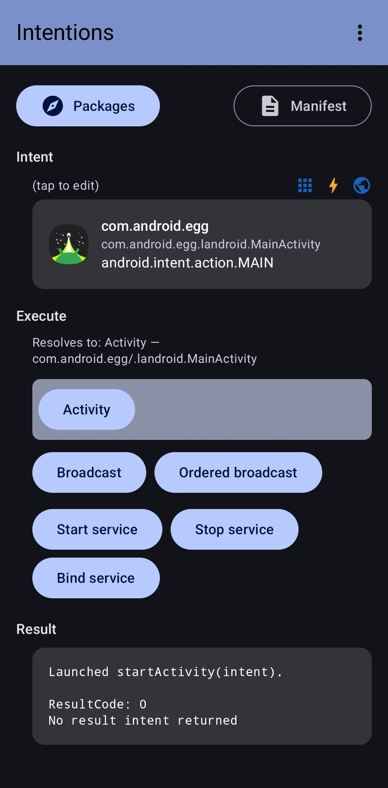
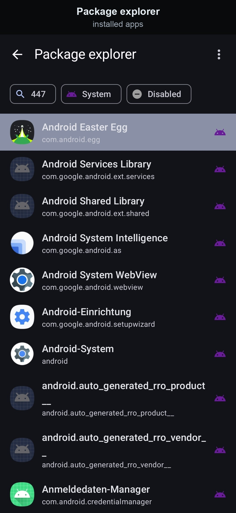
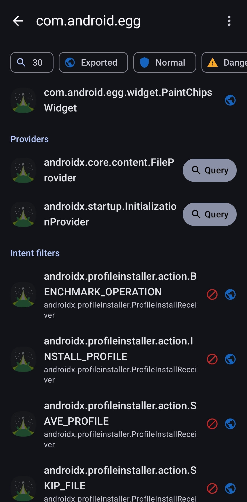
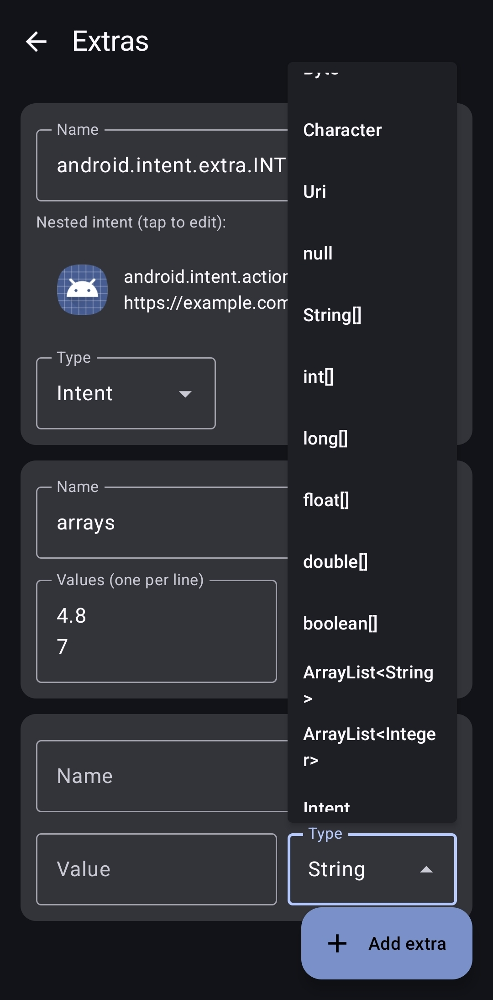
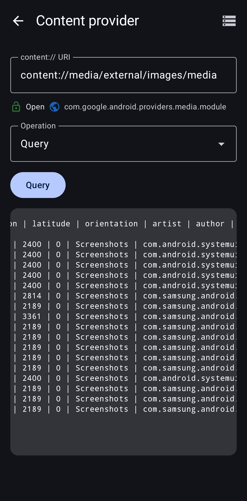
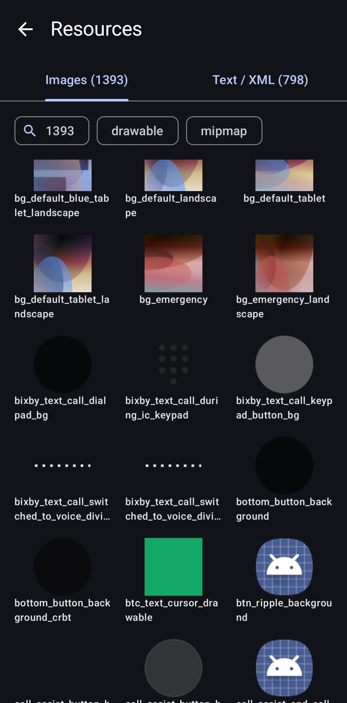

<div align="center">


# Intentions

</div>

A tool for **building, inspecting and dispatching Android Intents** — construct an intent
by hand, fire it as an activity / broadcast / service, explore everything installed apps
expose, and capture intents flowing through the system.

The app is largely a reconstruction of the Intentions app from 2012, whose code was lost.

> Security note: this is a tool for **authorized** testing of Android apps
> you own or are permitted to test. Use it responsibly.

---

## Features

### Screenshots

<p align="center">
  <a href="docs/screenshots/raw/main.jpg"></a>
  &nbsp;&nbsp;&nbsp;
  <a href="docs/screenshots/raw/package_explorer.jpg"></a>
  &nbsp;&nbsp;&nbsp;
  <a href="docs/screenshots/raw/package_explorer_components.jpg"></a>
</p>
<p align="center">
  <a href="docs/screenshots/raw/intent_editor.jpg"></a>
  &nbsp;&nbsp;&nbsp;
  <a href="docs/screenshots/raw/content_provider_query.jpg"></a>
  &nbsp;&nbsp;&nbsp;
  <a href="docs/screenshots/raw/resource_browser_images.jpg"></a>
</p>

### Build an intent
- **Intent editor** — set the component, action, data URI + MIME type, categories, extras
  and flags. Sections toggle on and off without losing what you've typed.
- **Typed extras** — add extras of any common type: `String`, `Boolean`, the numeric types,
  `Character`, `Uri`, `null`, a nested `Intent`, and array / list types. Values are checked
  as you type.
- **Autocomplete** for actions, categories and extra names.

### Dispatch it
From the **Execute** row:
- **Activity**, **Broadcast**, **Ordered broadcast**, **Start / Stop / Bind service**.
- The button group matching the intent's resolved target (activity / service / receiver) is
  highlighted, but any of them can still be tried.
- **Bind service** opens a panel where you can send **Messenger** messages
  (`what` / `arg1` / `arg2` plus a typed data bundle) and see the replies.
- When a dispatch is blocked, the result is a plain explanation plus a **Run via shell**
  option that retries the equivalent `am` command, with or without root.
- **Show manifest** — pretty-prints the target app's manifest (including split APKs), with
  resource references resolved to their names.

### Explore the system
- **Package explorer** — searchable list of installed apps. Open one to see its activities,
  services, receivers, providers and intent-filter actions, each marked with an **exported**
  badge and a **permission level** icon (open / normal / dangerous / signature). Tap a
  component to load it into the intent; tap **Query** on a provider to jump straight to a
  content query for it.
- **Data browsers** — every action, category, data scheme, MIME type and data authority
  declared across installed apps; tap to apply to the current intent.
- **Content provider** — against a `content://` URI, run **Query**, **Get type**, **Read**
  and **Call**, or — behind a confirmation — **Insert / Update / Delete**. The provider's
  exported / permission status is shown, a needed permission is requested when possible, and
  a **Run via shell** fallback (su / sh) is offered when access is denied.
- **Resource browser** — browse another app's images and text / XML resources (including its
  `AndroidManifest.xml`), with references resolved to names. Pick an entry as an
  `android.resource://…` URI, or copy its text.
- **App info / Force-stop** — open the system App-Info page for a package.

### Capture intents
- **Broadcast sniffer** — a background monitor that records system broadcasts as they happen.
  The watched-action list is editable; tap a captured entry to load it into the editor.
- **Scheme & share interceptor** — Intentions appears in the system "Open with" / share
  sheets; choosing it captures the incoming intent into the editor.

### Save & share
- **Bookmarks** — save intents and reload them later.
- **Recent intents** — automatic history of intents you've executed; tap to reload.
- **Copy as `adb` command** — generate a ready-to-run `adb shell am …` line.
- **Clipboard** — copy / paste an intent as a portable string.
- **Home-screen shortcut** — pin a shortcut that fires the current intent. Intentions also
  responds to a launcher's create-shortcut request.

---

## Permissions & notes
- `QUERY_ALL_PACKAGES` — the app's purpose is to enumerate and inspect other apps.
- `FOREGROUND_SERVICE` / `FOREGROUND_SERVICE_SPECIAL_USE` / `POST_NOTIFICATIONS` — the
  background broadcast sniffer and its notification.
- Media and provider read permissions (`READ_MEDIA_*`, `READ_CONTACTS`, `READ_CALENDAR`,
  `READ_SMS`, `READ_CALL_LOG`) — requested on demand so the content-provider screen can
  return rows from those providers.
- `KILL_BACKGROUND_PROCESSES`, `INSTALL_SHORTCUT` — the force-stop helper and legacy shortcut
  fallback.

Modern Android limits some original capabilities: listing or killing *other apps'* running
services is no longer allowed (Android 8+), so the app opens the system App-Info / force-stop
page instead.

## Install
Grab the latest **`intentions-release.apk`** from the
[Releases page](https://github.com/dmatscheko/intentions-android/releases/latest)
and install it by opening the file on the device ("Install unknown apps"), or via adb:

```bash
adb install -r intentions-release.apk
```

Prefer to build it yourself? A debug build can be built and installed in one step:

```sh
./gradlew installDebug
```

To install with adb instead, build the APK first, then install it:

```bash
./gradlew assembleDebug
adb install -r app/build/outputs/apk/debug/intentions-debug.apk
```

See [DEVELOPMENT.md](DEVELOPMENT.md) for the toolchain and architecture.

This app is **sideloaded** — it is not on the Play Store.

---

## License

Copyright (C) 2026 David Matscheko

This program is free software: you can redistribute it and/or modify it under the
terms of the **GNU Affero General Public License** as published by the Free Software
Foundation, either version 3 of the License, or (at your option) any later version.

This program is distributed in the hope that it will be useful, but WITHOUT ANY
WARRANTY; without even the implied warranty of MERCHANTABILITY or FITNESS FOR A
PARTICULAR PURPOSE. See the GNU Affero General Public License for more details.

You should have received a copy of the GNU Affero General Public License along with
this program. If not, see <https://www.gnu.org/licenses/>. The full text is in
[LICENSE](LICENSE).
